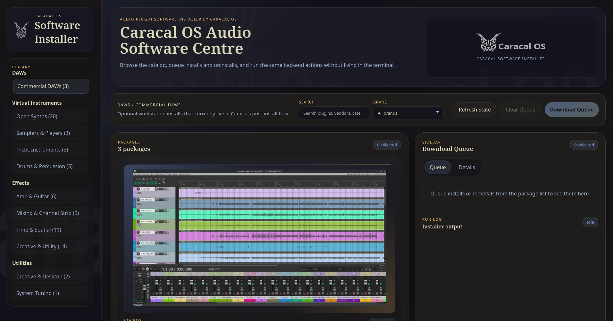
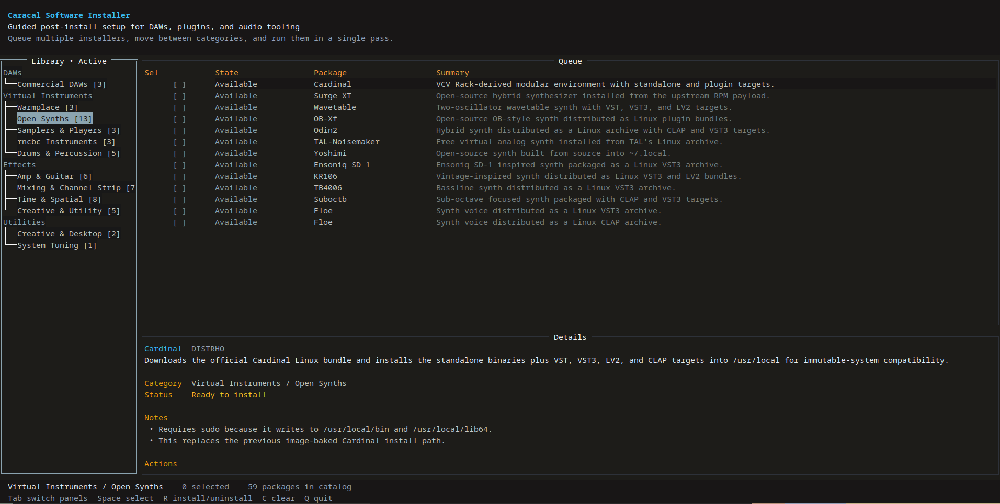

# Caracal Software Installer

`caracal-software-installer` is a Go installer app for guided post-install setup on Caracal OS. It presents optional DAWs, instruments, plugins, and audio utilities in browsable categories and lets the user queue multiple installs in one pass.

The repo now includes:

- a `tview` terminal UI at `cmd/caracal-software-installer`
- a Wails desktop GUI at the repo root / `main.go`

## Screenshots

### Desktop GUI



### Terminal UI



## Current catalog

- DAWs
  - REAPER
  - Renoise
  - Bitwig Studio
- Virtual Instruments
  - Open Synths: SunVox, Virtual ANS, Cardinal, Surge XT, Wavetable, OB-Xf, Odin2, TAL-Noisemaker, Dexed, JuceOPL, OBXD, Vex, Wolpertinger, Yoshimi, Ensoniq SD 1, KR106, TB4006, Suboctb, Floe (VST3), Floe (CLAP)
  - Samplers & Players: Loopino, Decent Sampler
  - rncbc Instruments: Synthv1, Samplv1, Padhv1
  - Drums & Percussion: jDrummer, Drumkv1, Drum Locker, Drum Groove Pro, Black Widow Drums
- Effects
  - Amp & Guitar: Amp Locker, BYOD, Neural Amp Modeler, AIDA-X
  - Mixing & Channel Strip: Mix Locker, The Trick, Polarity, NineStrip, LUFS Meter, Luftikus
  - Reverb & Spatial: Dragonfly Reverb, KlangFalter, MVerb, Pitched Delay, WetDelay, WetReverb
  - Creative & Utility: Noise Repellent, EasySSP, Stereo Source Separator, DPF Plugins, Arctican Plugins, dRowAudio Plugins, Juced Plugins, NDC Plugins, TAL Plugins, INTERSECT, Spectrus, WarpCore, Zam Plugin Suite
- Utilities
  - Creative & Desktop: MuseScore Studio, Declick
  - System Tuning: RTCQS

The UI is catalog-driven, and download URLs plus related archive metadata now live in `data/download-index.csv`. The catalog and helper scripts resolve package metadata from that index so link updates stay spreadsheet-friendly.

`catalog-links.csv` is generated from the same catalog metadata and can be refreshed with:

```bash
env GOCACHE=/tmp/go-build-cache GOMODCACHE=/tmp/go-mod-cache go run ./cmd/export-catalog-links > catalog-links.csv
```

The download index can be validated from a repo checkout with:

```bash
scripts/download-index validate
scripts/download-index validate --check-urls
```

## Development

```bash
go mod tidy
go run ./cmd/caracal-software-installer
```

Packaged command layout:

- `caracal-software-installer` launches the terminal UI
- `caracal-software-installer-gui` launches the Wails desktop frontend
- the `.desktop` launcher targets the GUI build

To run the Wails desktop frontend manually from Go:

```bash
go run -tags dev .
```

To use the normal Wails workflow:

```bash
go install github.com/wailsapp/wails/v2/cmd/wails@latest
wails dev
wails build
```

The repo-level `wails.json` points Wails at `frontend/` and `frontend/dist/`, and the frontend package uses a minimal `npm run build` check so the static GUI assets work with Wails without needing a separate SPA toolchain.

On Fedora Atomic / Universal Blue style systems, these helper wrappers are the safer entrypoint because they add the `webkit2_41` tag automatically when the host exposes the newer WebKit package name:

```bash
./scripts/wails-dev.sh
./scripts/wails-build.sh
```

Switch the packaged desktop icon by copying one of the PNGs in `build/icons/` to `build/appicon.png`:

```bash
./scripts/switch-app-icon
./scripts/switch-app-icon caracal-lakers.png
```

On Linux, root-requiring installer actions are routed through `pkexec` so they can prompt graphically instead of assuming an interactive terminal.

The app looks for installer scripts in:

1. `CARACAL_INSTALLER_SCRIPT_DIR`
2. `/usr/lib/caracal-software-installer/scripts`
3. `scripts/` in the current repo or a parent directory

Most package installs write to `/opt`, `/usr/local`, or the current user's home directory so they work on an atomic Caracal system without rpm layering.

## Contributing
Pull requests welcome. Just create a feature branch and submit a pull request with details about the change, what software you are adding to the catalog etc.

If you are currently running a Fedora Atomic image, you can clone this repo and run it locally and see if the installation you added work.

## TODO
1. ~~Add an uninstall option~~
2. Add sudo password and installation processing to happen within the program program so the user does not exit and then return.
3. Move all the Caracal default plugins and music software here and embed install into Caracal OS
4. Add more plugins
5. Fix general jank
